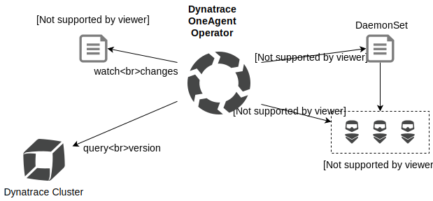

[](https://circleci.com/gh/Dynatrace/dynatrace-oneagent-operator)
[](https://quay.io/repository/dynatrace/dynatrace-oneagent-operator)

# Dynatrace OneAgent Operator

This is the home of Dynatrace OneAgent Operator which supports the rollout and lifecycle of [Dynatrace OneAgent](https://www.dynatrace.com/support/help/get-started/introduction/what-is-oneagent/) in Kubernetes and OpenShift clusters.
Rolling out Dynatrace OneAgent via DaemonSet on a cluster is straightforward.
Maintaining its lifecycle places a burden on the operational team.
Dynatrace OneAgent Operator closes this gap by automating the repetitive steps involved in keeping Dynatrace OneAgent at its latest desired version.


## Overview

Dynatrace OneAgent Operator is based on [Operator SDK](https://github.com/operator-framework/operator-sdk) and uses its framework for interacting with Kubernetes and OpenShift environments.
It watches custom resources `OneAgent` and monitors the desired state constantly.
The rollout of Dynatrace OneAgent is managed by a DaemonSet initially.
From here on Dynatrace OneAgent Operator controlls the lifecycle and keeps track of new versions and triggers updates if required.



## Supported platforms

Dynatrace OneAgent Operator is supported on the following platforms:
* Kubernetes 1.9+
* OpenShift Container Platform 3.9+

Help topic _How do I deploy Dynatrace OneAgent as a Docker container?_ lists compatible image and OneAgent versions in its [requirements section](https://www.dynatrace.com/support/help/infrastructure/containers/how-do-i-deploy-dynatrace-oneagent-as-docker-container/#requirements).


## Quick Start

The Dynatrace OneAgent Operator acts on its separate namespace `dynatrace`.
It holds the operator deployment and all dependent objects like permissions, custom resources and
corresponding DaemonSets.
Create neccessary objects and observe its logs:

#### Kubernetes
```sh
$ kubectl create -f https://raw.githubusercontent.com/Dynatrace/dynatrace-oneagent-operator/master/deploy/kubernetes.yaml
$ kubectl -n dynatrace logs -f deployment/dynatrace-oneagent-operator
```

#### OpenShift
```sh
$ oc create -f https://raw.githubusercontent.com/Dynatrace/dynatrace-oneagent-operator/master/deploy/openshift.yaml
$ oc -n dynatrace logs -f deployment/dynatrace-oneagent-operator
```


#### Create `OneAgent` custom resource for OneAgent rollout
The rollout of Dynatrace OneAgent is governed by a custom resource of type `OneAgent`:
```yaml
apiVersion: dynatrace.com/v1alpha1
kind: OneAgent
metadata:
  # a descriptive name for this object.
  # all created child objects will be based on it.
  name: oneagent
  namespace: dynatrace
spec:
  # dynatrace api url including `/api` path at the end
  apiUrl: https://ENVIRONMENTID.live.dynatrace.com/api
  # disable certificate validation checks for installer download and API communication
  skipCertCheck: false
  # name of secret holding `apiToken` and `paasToken`
  # if unset, name of custom resource is used
  tokens: ""
  # node selector to control the selection of nodes (optional)
  nodeSelector: {}
  # https://kubernetes.io/docs/concepts/configuration/taint-and-toleration/ (optional)
  tolerations: []
  # oneagent installer image (optional)
  image: ""
  # arguments to oneagent installer (optional)
  # https://www.dynatrace.com/support/help/shortlink/oneagent-docker#limitations
  args:
  - APP_LOG_CONTENT_ACCESS=1
  # environment variables for oneagent (optional)
  env: []
```
Save the snippet to a file or use [./deploy/cr.yaml](https://raw.githubusercontent.com/Dynatrace/dynatrace-oneagent-operator/master/deploy/cr.yaml) from this repository and adjust its values accordingly.
A secret holding tokens for authenticating to the Dynatrace cluster needs to be created upfront.
Create access tokens of type *Dynatrace API* and *Platform as a Service* and use its values in the following commands respectively.
For assistance please refere to [Create user-generated access tokens](https://www.dynatrace.com/support/help/get-started/introduction/why-do-i-need-an-access-token-and-an-environment-id/#create-user-generated-access-tokens).

Note: `.spec.tokens` denotes the name of the secret holding access tokens. If not specified OneAgent Operator searches for a secret called like the OneAgent custom resource (`.metadata.name`).

##### Kubernetes
```sh
$ kubectl -n dynatrace create secret generic oneagent --from-literal="apiToken=DYNATRACE_API_TOKEN" --from-literal="paasToken=PLATFORM_AS_A_SERVICE_TOKEN"
$ kubectl create -f cr.yaml
```

##### OpenShift
```sh
$ oc -n dynatrace create secret generic oneagent --from-literal="apiToken=DYNATRACE_API_TOKEN" --from-literal="paasToken=PLATFORM_AS_A_SERVICE_TOKEN"
$ oc create -f cr.yaml
```


## Uninstall dynatrace-oneagent-operator
Remove OneAgent custom resources and clean-up all remaining OneAgent Operator specific objects:


#### Kubernetes
```sh
$ kubectl delete -n dynatrace oneagent --all
$ kubectl delete -f https://raw.githubusercontent.com/Dynatrace/dynatrace-oneagent-operator/master/deploy/kubernetes.yaml
```

#### OpenShift
```sh
$ oc delete -n dynatrace oneagent --all
$ oc delete -f https://raw.githubusercontent.com/Dynatrace/dynatrace-oneagent-operator/master/deploy/openshift.yaml
```


## Hacking

See [HACKING](HACKING.md) for details on how to get started enhancing Dynatrace OneAgent Operator.


## Contributing

See [CONTRIBUTING](CONTRIBUTING.md) for details on submitting changes.


## License

Dynatrace OneAgent Operator is under Apache 2.0 license. See [LICENSE](LICENSE) for details.
